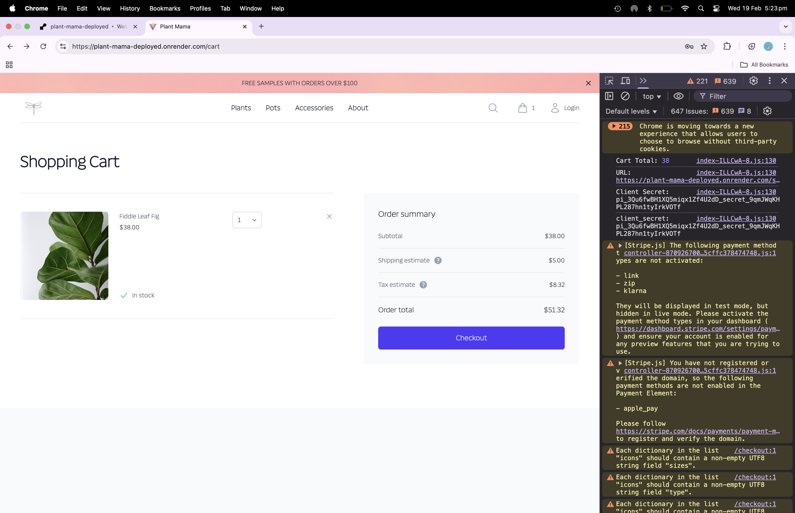
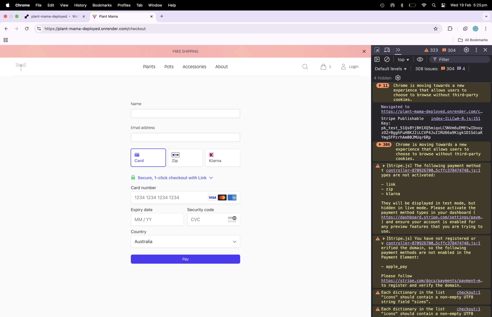
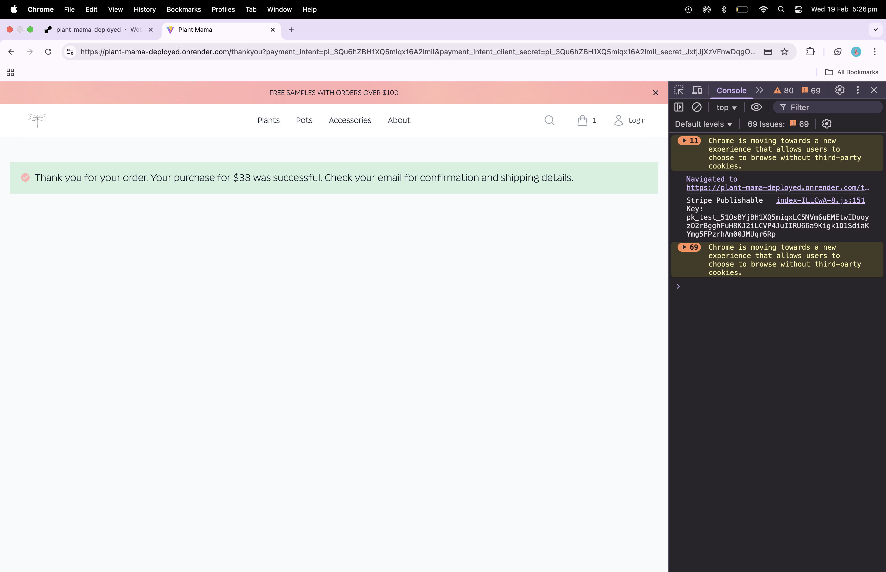

# Plant Mama

## Table of Contents

- [Description](#description)
- [Installation](#installation)
- [Usage](#usage)
- [License](#license)
- [Contributing Guidelines](#contributing-guidelines)
- [Testing](#testing)
- [Authors and Acknowledgements](#authors-and-acknowledgements)
- [Questions](#questions)

## Description

A scalable user-focused e-commerce MERN app featuring:

- Vite + React + Typescript

- Tailwind CSS + custom CSS

- Node & Express.js

- MongoDB & Mongoose ODM

- GraphQl API

- Apollo Server

- User authentication with JWT

- Stripe

## Installation

To get started with this project, implement the following steps:

1. Clone the repo:

```zsh
git clone git@github.com:gina-t/plant-mama-deployed.git
```
2. In `root` directory, install dependencies:

```zsh
npm install 
```

3. In `server` directory, install dependencies:

```zsh
npm install 
```

4. In `client` directory, install dependencies:

```zsh
npm install 
```

5. In `server` directory, run build, seed and start scripts to successfully start server:

```zsh
npm run build
npm run seed
npm run start
```

6. In `root` directory, run:

```zsh
npm run dev
```

7. In `.env.production`, add your MongoDB Atlas connection string to `MONGO_DB_URI`.

8. To get started with Stripe, you need to open a Stripe account. After opening your account, navigate to the developer's section and access your API keys.

```plaintext
publishable key 
secret key
```

9. Copy and paste the `STRIPE_SECRET_KEY` to `.env/development` and `.env/production`.

10. Install the Stripe library in your server and configure an express route for `app.post('/secret')`.

11. Setup stripe in React:

  - Create a `.env` file and copy and paste the `STRIPE_PUBLISHABLE_KEY` prefixed by `VITE`

  - Install Stripe libraries:
    
    ```zsh
    npm install --save @stripe/react-stripe-js @stripe/stripe-js
    ```

  - There are 5 important Stripe elements for React:

    - `initstripe.ts` to initialise Stripe

    - `payment-intent.ts` to fetch the call

    - `StripePaymentForm.tsx` to handle the payment

    - `payment-status.ts` to check the payment status from Stripe

    - `Thankyou.tsx` to confirm payment

    - `StripePaymentForm` and `payment-intent` contain a ternary operator for the value of the `url` variable either in production or development

13. Successful Render deployment requires the following environment variables:

- `JWT_SECRET_KEY` for production

- `MONGO_DB_URI` containing MongoDB Atlas connection string

- `NODE_ENV` for production

- `STRIPE_SECRET_KEY`

- `VITE_STRIPE_PUBLISHABLE_KEY`

## Usage

Link to deployed app URL:

[plant-mama-deployed](https://plant-mama-deployed.onrender.com)

Screenshots of app demonstrating functionality:

### storefront page


### login route


### cart route



### checkout route




### thankyou route



## License

[](https://opensource.org/licenses/MIT)

## Contributing Guidelines

To contribute, please follow these steps:

1. **Fork the Repository**:
   - Navigate to `https://github.com/gina-t/plant-mama-deployed`
   - Click "Fork" to create a copy of the repository in your GitHub account.

2. **Clone the Forked Repository**:
   - Clone the forked repository to your local machine:
     ```zsh
     git clone git@github.com:gina-t/plant-mama-deployed.git
     ```
   - Navigate to the project directory:
     ```zsh
     cd plant-mama-deployed
     ```

3. **Create a New Feature Branch**:
   - Create a new branch for your feature or bug fix:
     ```zsh
     git checkout -b feature/your-feature-name
     ```

4. **Make Changes**:
   - Make your changes to the codebase.
   - Ensure your changes follow the project's coding standards and guidelines.

5. **Commit Your Changes**:
   - Stage your changes:
     ```zsh
     git add -A
     ```
   - Commit your changes with a descriptive commit message:
     ```zsh
     git commit -m "Add your descriptive commit message here"
     ```

6. **Push Your Changes**:
   - Push your changes to your forked repository:
     ```zsh
     git push origin feature/your-feature-name
     ```

7. **Create a Pull Request**:
   - Navigate to the original repository.
   - Click the "New Pull Request" button.
   - Select your feature branch from your forked repository and compare it with the Develop branch of the original repository.
   - Provide a title and description for your pull request.
   - Click "Create Pull Request" to submit your changes for review.

8. **Review Process**:
   - Your pull request will be reviewed by the project maintainer.
   - Once your pull request is approved, it will be merged into the `develop` branch.

Thank you for contributing to the project.

## Testing

Component testing can be performed by installing Cypress

## Authors and Acknowledgements

[email] (ginadrcoder@gmail.com)

## Questions

For enquiries, please contact me at:

[email] (ginadrcoder@gmail.com)

[github] (https://github.com/gina-t)


